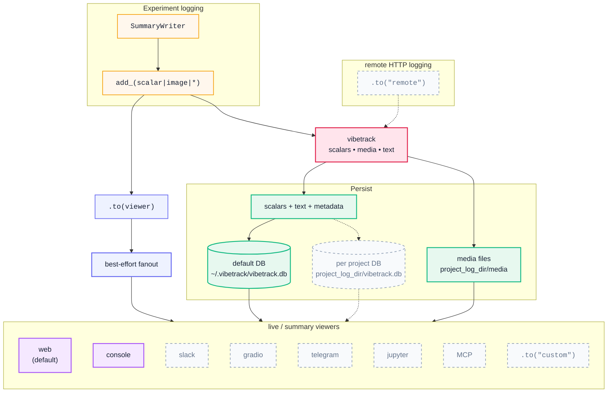

# vibetrack

Modern experiment tracking.


Key features:

- Send experiment results elsewhere: Telegram, Slack, Jupyter, Gradio, and MCP.
- Run locally while receiving experiment data over the network via REST API.
- Use open formats: experiment data is stored in SQLite and local files.
- Compare image-to-image results.
- Use a rich UI to show, hide, delete, and customize runs.
- TensorBoard SummaryWriter compatible drop-in APIs.
- Query results through the MCP server.
- Fast scalar logging; see the [benchmark report](https://github.com/chroneus/vibetrack/blob/main/docs/BENCHMARK.md).


## Install

```bash
pip install vibetrack          # default with web
pip install vibetrack[all]     # all optional backends+dev; MCP on Python >=3.10
```

## Quick start

### TensorBoard-style API

```python
from vibetrack import SummaryWriter

writer = SummaryWriter("runs/exp1", project_folder="my_project")
for step in range(100):
    writer.add_scalar("loss", 1.0 / (step + 1), step)
    writer.add_scalar("acc", step / 100, step)
writer.close()
```
See [API.md](https://github.com/chroneus/vibetrack/blob/main/docs/API.md) for SummaryWriter and module-level logging examples.

### Launch the dashboard

```bash
vibetrack --listen 0.0.0.0:6116
# -> Web UI on http://you_server:6116
# -> MCP is also mounted when installed with vibetrack[all] on Python 3.10+
```

### Viewers and destinations syntax

```python

writer = SummaryWriter("runs/exp1", project_folder="my_project")
writer.to("console").to("slack", every="15m")
writer.to("remote", url="http://server:8080", token="devtoken")
writer.add_scalar("loss", 0.5, step=0).to("telegram")
```

See [VIEWERS.md](https://github.com/chroneus/vibetrack/blob/main/docs/VIEWERS.md) for web, console, Slack, Telegram, Gradio,
Jupyter, custom viewers, remote forwarding, credentials, and HTTP ingest.

# vibetrack Architecture




# FAQ

## How do I collect results from another server?

Run a vibetrack ingest server on the machine that should receive results:

```bash
vibetrack --listen 0.0.0.0:8080 --token devtoken --project-folder /srv/runs
```

Then forward events from the training machine:

```python
from vibetrack import SummaryWriter

writer = SummaryWriter("runs/exp1", project_folder="my_project")
writer.to("remote", url="http://server:8080", token="devtoken")
```

See [VIEWERS.md](https://github.com/chroneus/vibetrack/blob/main/docs/VIEWERS.md#remote-event-forwarding) for remote forwarding
and direct HTTP ingest.

## How do I use separate databases on one machine?

By default, vibetrack writes to `~/.vibetrack/vibetrack.db`. Pass
`project_folder` to keep a separate `vibetrack.db` inside that project folder.

```python
from vibetrack import SummaryWriter

writer = SummaryWriter("runs/exp1", project_folder="projects/cv")
```

Open that database in the dashboard with the same folder:

```bash
vibetrack --project-folder projects/cv
```

## How does vibetrack work with distributed training?

vibetrack automatically detects `RANK` / `LOCAL_RANK`. Only rank 0 logs by
default; other ranks get a silent no-op writer.

```python
from vibetrack import SummaryWriter

writer = SummaryWriter("runs/distributed", project_folder="project/")
writer.add_scalar("loss", loss.item(), step)
writer.close()
```

To force every rank to log, pass `rank="all"`:

```python
writer = SummaryWriter("runs/distributed", rank="all")
```

## Can vibetrack collect system resources?

Yes. vibetrack can collect CPU, GPU, memory, and project disk metrics in a
background thread.

```python
writer = SummaryWriter("runs/exp1", system_metrics_interval=3600)  # every hour
```

Collected metrics include `system/cpu_percent`, `system/mem_used_gb`,
`system/disk_free_gb`, `gpu/utilization`, `gpu/memory_used_gb`, and
`gpu/temperature`. Use `system_metrics_interval=0` to disable collection.

## How do I run the MCP server for an LLM agent?

Install MCP dependencies, then run the standalone MCP server:

```bash
pip install vibetrack[all]
vibetrack --viewer mcp --project-folder my_project/
```

See [MCP.md](https://github.com/chroneus/vibetrack/blob/main/docs/MCP.md) for MCP endpoints, tools, resources, and agent usage.

## What CLI commands are available?

```bash
vibetrack                           # default
vibetrack [PROJECT_FOLDER]          # Launch dashboard (web + ingest; MCP with vibetrack[all] on Python 3.10+)
vibetrack --port 8080               # Custom port
vibetrack --token SECRET            # Protect ingest endpoints
vibetrack --listen 0.0.0.0:9009     # Open server on separate port
vibetrack migrate PROJECT_FOLDER    # Merge legacy per-run DBs into project DB
```

## How is vibetrack configured?

Settings are stored in `~/.vibetrack/config.json`. The web UI can also write
project-scoped settings through its Settings tab.

```json
{
  "smoothing": "ema",
  "smooth_weight": 0.6,
  "system_metrics_interval": 3600,
  "web": {
    "theme": "light",
    "auto_refresh": 5,
    "image_play_fps": 2,
    "original_values_opacity": 0.17
  }
}
```

## License

Apache 2.0
