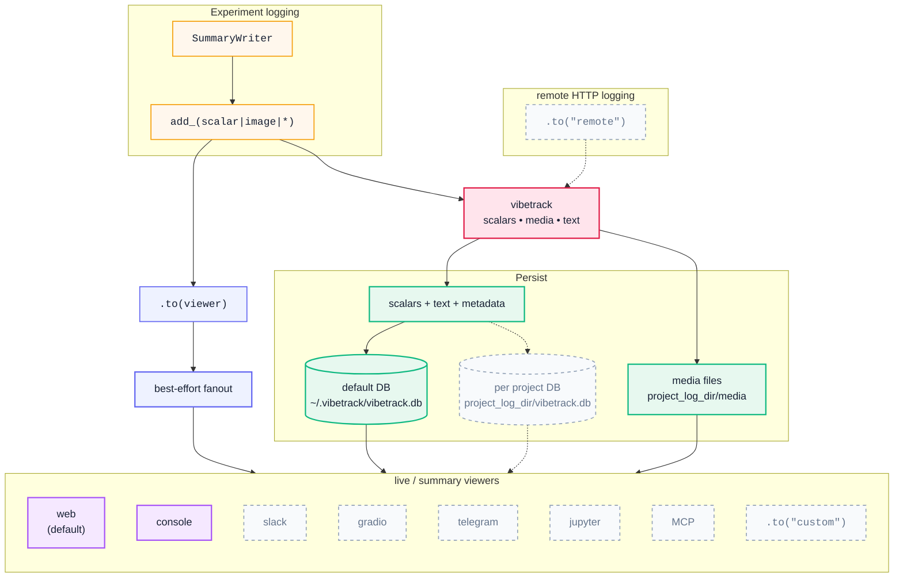

# vibetrack

Lightweight experiment tracking.

Key features:
    Send experiment results to elsewhere: Telegram/Slack/Jupyter/Gradio/MCP
    Run locally but could receive experiment data over network via REST API. 
    Open formats: store experiment data in sqlite and local files. 
    Image2image comparison. 
    Rich UI.
    TensorBoard-compatible logging APIs
    MCP server with results


## Install

```bash
pip install vibetrack          # default with web
pip install vibetrack[all]     # all optional backends+dev; MCP on Python >=3.10
```

## Quick start

### TensorBoard-style API

```python
from vibetrack import SummaryWriter

writer = SummaryWriter("runs/exp1", project_folder="my_project")
for step in range(100):
    writer.add_scalar("loss", 1.0 / (step + 1), step)
    writer.add_scalar("acc", step / 100, step)
writer.close()
```

### Module-level API

```python
import vibetrack

vibetrack.init(project="my_project", name="run_1", config={"lr": 0.01, "epochs": 50})
for step in range(100):
    vibetrack.log({"loss": 1.0 / (step + 1), "acc": step / 100})
vibetrack.finish()
```

### Launch the dashboard

```bash
vibetrack
# -> Web UI on http://0.0.0.0:6116
# -> MCP is also mounted when installed with vibetrack[all] on Python 3.10+
```

### Viewers and destinations

```python
from vibetrack import SummaryWriter

writer = SummaryWriter("runs/exp1", project_folder="my_project")
writer.to("console").to("slack", every="15m")
writer.add_scalar("loss", 0.5, step=0).to("telegram")
```

See [VIEWERS.md](VIEWERS.md) for web, console, Slack, Telegram, Gradio,
Jupyter, custom viewers, remote forwarding, credentials, and HTTP ingest.

# vibetrack Architecture




## API reference

### SummaryWriter

```python
from vibetrack import SummaryWriter

writer = SummaryWriter("runs/exp1", name="experiment_name", project_folder="project/")

# Scalars
writer.add_scalar("loss", 0.5, step=0)
writer.add_scalars("metrics", {"train_loss": 0.5, "val_loss": 0.6}, step=0)

# Images — accepts file paths, numpy arrays, or PIL Images
writer.add_image("samples", "path/to/image.png", step=0)

# Audio — accepts file paths or numpy waveforms
writer.add_audio("speech", waveform_array, step=0, sample_rate=16000)

# Video
writer.add_video("rollout", "path/to/video.mp4", step=0)

# Artifacts — any file with optional metadata
writer.add_artifact("checkpoint", "model.pt", step=0, metadata={"val_acc": 0.95})

# Text
writer.add_text("notes", "Training started with lr=0.01", step=0)

# Histograms
writer.add_histogram("weights", weight_tensor, step=0)

# Hyperparameters
writer.add_hparams({"lr": 0.01, "batch_size": 32}, {"best_acc": 0.95})

writer.close()
```

### Module-level logging API

```python
import vibetrack
from vibetrack import Image, Audio, Video, Artifact

vibetrack.init(project="nlp", name="bert-finetune", config={"lr": 3e-5})

# Log scalars
vibetrack.log({"loss": 0.3, "acc": 0.92})

# Log media with wrapper types
vibetrack.log({"sample": Image("output.png")})
vibetrack.log({"audio": Audio("clip.wav", sample_rate=22050)})
vibetrack.log({"demo": Video("result.mp4")})
vibetrack.log({"model": Artifact("best_model.pt", metadata={"epoch": 10})})

# Access config
vibetrack.config["lr"]  # 3e-5

vibetrack.finish()
```

## Distributed training (torchrun)

vibetrack automatically detects `RANK` / `LOCAL_RANK` environment variables. Only rank 0 logs data — all other ranks get a silent no-op writer.

```bash
torchrun --nproc_per_node=4 --nnodes=2 train.py
```

```python
# train.py — no code changes needed
from vibetrack import SummaryWriter

writer = SummaryWriter("runs/distributed", project_folder="project/")
# Only rank 0 writes to the database. Other ranks silently skip.
writer.add_scalar("loss", loss.item(), step)
writer.close()
```

Force all ranks to log:

```python
writer = SummaryWriter("runs/distributed", rank="all")
```

## System metrics

Built-in collection of CPU, GPU, memory, and disk metrics. Runs in a background thread.

```python
writer = SummaryWriter("runs/exp1", system_metrics_interval=3600)  # every hour (default)
```

Collected metrics: `system/cpu_percent`, `system/mem_used_gb`, `system/disk_free_gb`, `gpu/utilization`, `gpu/memory_used_gb`, `gpu/temperature`, and automatic alerts when resources are critically low.

## MCP server

MCP lets LLM apps query experiment data and compact metric/image analysis tools.
See [MCP.md](MCP.md) for tools, resources, standalone server usage, and the LLM
demo.

## CLI

```bash
vibetrack                           # default  
vibetrack [PROJECT_FOLDER]          # Launch dashboard (web + ingest; MCP with vibetrack[all] on Python 3.10+)
vibetrack --port 8080               # Custom port
vibetrack --token SECRET            # Protect ingest endpoints
vibetrack --listen 0.0.0.0:9009     # Open server on separate port
vibetrack migrate PROJECT_FOLDER    # Merge legacy per-run DBs into project DB
```

## Configuration

Settings are stored in `~/.vibetrack/config.json` (global) or per-project via the API:

```json
{
  "smoothing": "ema",
  "smooth_weight": 0.6,
  "system_metrics_interval": 3600,
  "web": {
    "theme": "light",
    "auto_refresh": 5,
    "image_play_fps": 2,
    "original_values_opacity": 0.17
  }
}
```

## License

Apache 2.0
