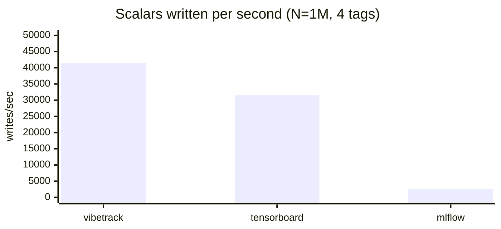
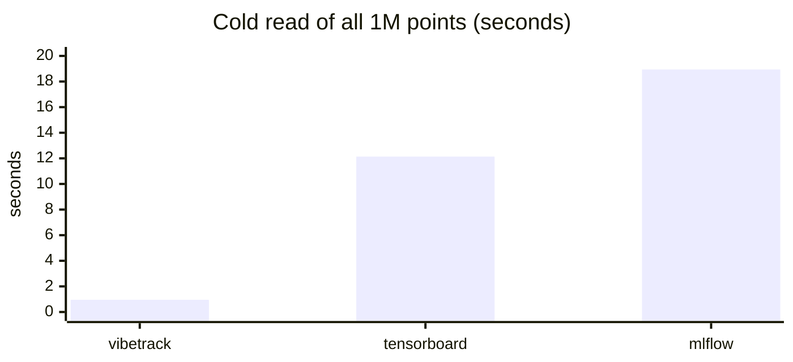
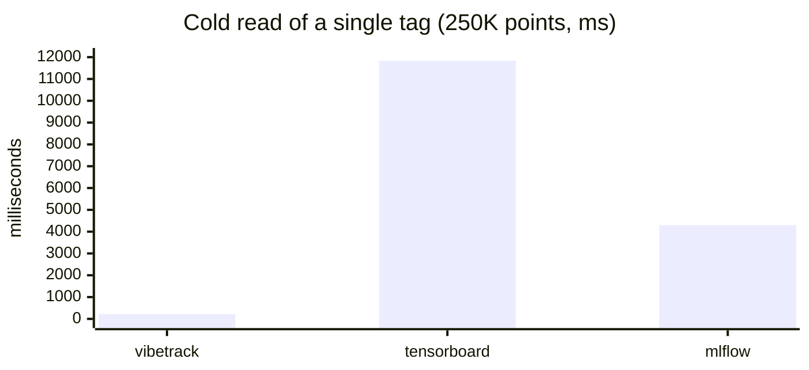

# Scalar logging benchmark

In-process scalar logging — vibetrack vs TensorBoard (`torch.utils.tensorboard`) vs MLflow with its **default file-store backend**. Each row writes N total scalars round-robin across 4 tags, then reopens the store cold and reads back.

Reproduce with `benchmark/bench_scalars.py`.

## Environment

- Ryzen 9 5950X · 46 GiB RAM · Linux 6.17 · Python 3.13.12
- vibetrack 0.1a0 · tensorboard 2.20.0 · mlflow 3.11.1
- Single process, no GPU/network

## Results

### N = 1,000 writes, 4 tags

| tool        | write   | write rate    | read 1 tag           | read all tags         |
|-------------|--------:|--------------:|---------------------:|----------------------:|
| vibetrack   |  0.02 s |    65,077 /s  |   0.7 ms (250 pts)   |    1.2 ms (1,000 pts) |
| tensorboard |  0.04 s |    28,283 /s  |  12.0 ms (250 pts)   |   11.6 ms (1,000 pts) |
| mlflow      |  0.42 s |     2,362 /s  |   0.7 ms (250 pts)   |    3.5 ms (1,000 pts) |

### N = 100,000 writes, 4 tags

| tool        | write    | write rate    | read 1 tag             | read all tags             |
|-------------|---------:|--------------:|-----------------------:|--------------------------:|
| vibetrack   |   2.26 s |   44,174 /s   |   21.8 ms (25,000 pts) |    78.5 ms (100,000 pts)  |
| tensorboard |   3.22 s |   31,101 /s   | 1141.8 ms (25,000 pts) |  1160.6 ms (100,000 pts)  |
| mlflow      |  38.08 s |    2,626 /s   |   24.0 ms (25,000 pts) |   188.2 ms (100,000 pts)  |

### N = 1,000,000 writes, 4 tags

| tool        | write    | write rate    | read 1 tag                | read all tags                 |
|-------------|---------:|--------------:|--------------------------:|------------------------------:|
| vibetrack   |  24.12 s |   41,465 /s   |   219.5 ms (250,000 pts)  |    952.5 ms (1,000,000 pts)   |
| tensorboard |  31.72 s |   31,521 /s   | 11834.3 ms (250,000 pts)  |  12140.7 ms (1,000,000 pts)   |
| mlflow      | 389.81 s |    2,565 /s   |  4300.0 ms (250,000 pts)  |  18942.3 ms (1,000,000 pts)   |

## Charts

Bars at N = 1,000,000 (the most representative scale). Render natively on GitHub.

**Write throughput — higher is better**



**Read-all-tags latency — lower is better**



**Read-one-tag latency — lower is better**



## Takeaways

**Writes.** vibetrack sustains ~40 k scalars/s and is **~1.4× faster than TensorBoard**, **~16× faster than MLflow** across all scales. TensorBoard's bottleneck is protobuf serialization plus its async event-file writer; vibetrack batches into SQLite transactions. MLflow's `log_metric` writes one append per call to the file store, which doesn't amortize.

**Reads.** vibetrack wins by 10–50× at 100K+. TensorBoard's `EventAccumulator.Reload()` parses and aggregates the entire event file before returning a single tag — that's the ~12 s ceiling at 1 M points regardless of which tag you ask for. vibetrack uses an indexed SQL query, so a single tag is much cheaper than reading everything. MLflow's file store is fast for small reads but degrades roughly linearly: 1 M points takes ~19 s.

**MLflow caveats.** Numbers above use the default **file** backend (`./mlruns`). MLflow can be much faster *or* slower depending on configuration — `mlflow.log_metrics(dict, step=...)` (one bulk call per step) closes much of the write-rate gap, and the SQLite tracking backend is actually ~10× **slower** than the file store on this workload due to per-call SQLAlchemy + autocommit overhead. The file backend is also flagged deprecated as of February 2026.

**Variance.** Single runs. On this box, repeats were stable to within a few percent.

## How to reproduce

```bash
# default sweep — 1k, 100k, 1M for all three tools, MLflow file backend
python benchmark/bench_scalars.py

# fast smoke test
python benchmark/bench_scalars.py --scales 1000

# switch MLflow to its SQLite backend
python benchmark/bench_scalars.py --mlflow-backend sqlite

# write JSON + markdown
python benchmark/bench_scalars.py --out results.json --md results.md
```

## Caveats

- "Cold read" reopens the store but the OS page cache is warm from the write — realistic for "load dashboard right after training," optimistic for "load it hours later."
- TensorBoard writes go through its async `EventFileWriter` thread; we include `close()` in timings so the queue drains.
- vibetrack's system-metrics collector is disabled in the bench (`system_metrics_interval=0`) so background sampling doesn't pollute timings.
- Per-scalar API only (`add_scalar` / `log_metric`). Bulk APIs would change MLflow's numbers most of all.
