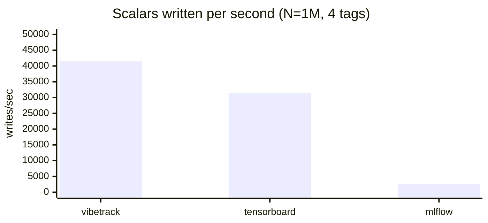
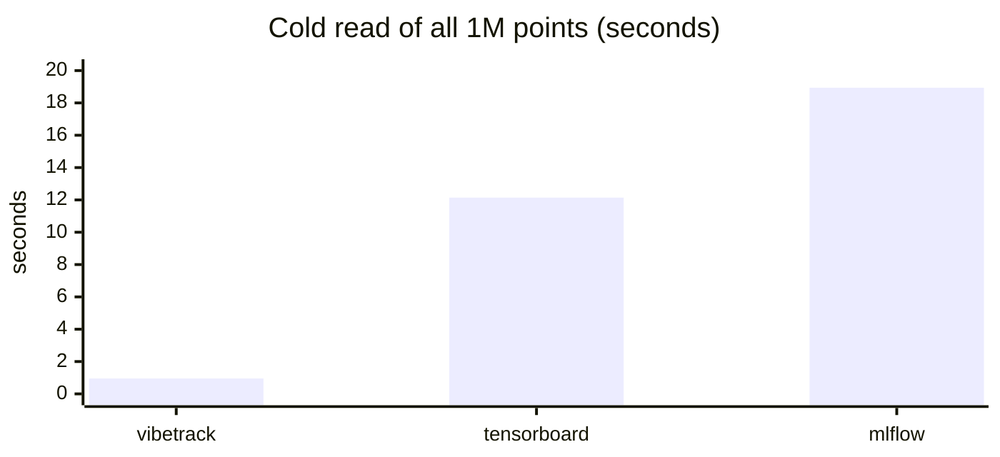
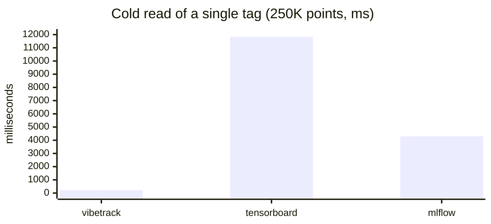

# Scalar logging benchmark

In-process scalar logging — vibetrack vs TensorBoard (`torch.utils.tensorboard`) vs MLflow with its **default file-store backend**. Each row writes N total scalars round-robin across 4 tags, then reopens the store cold and reads back.

The benchmark source used to produce these numbers is embedded at the bottom of
this document.

## Environment

- Ryzen 9 5950X · 46 GiB RAM · Linux 6.17 · Python 3.13.12
- vibetrack 0.1a0 · tensorboard 2.20.0 · mlflow 3.11.1
- Single process, no GPU/network

## Results

### N = 1,000 writes, 4 tags

| tool        | write   | write rate    | read 1 tag           | read all tags         |
|-------------|--------:|--------------:|---------------------:|----------------------:|
| vibetrack   |  0.02 s |    65,077 /s  |   0.7 ms (250 pts)   |    1.2 ms (1,000 pts) |
| tensorboard |  0.04 s |    28,283 /s  |  12.0 ms (250 pts)   |   11.6 ms (1,000 pts) |
| mlflow      |  0.42 s |     2,362 /s  |   0.7 ms (250 pts)   |    3.5 ms (1,000 pts) |

### N = 100,000 writes, 4 tags

| tool        | write    | write rate    | read 1 tag             | read all tags             |
|-------------|---------:|--------------:|-----------------------:|--------------------------:|
| vibetrack   |   2.26 s |   44,174 /s   |   21.8 ms (25,000 pts) |    78.5 ms (100,000 pts)  |
| tensorboard |   3.22 s |   31,101 /s   | 1141.8 ms (25,000 pts) |  1160.6 ms (100,000 pts)  |
| mlflow      |  38.08 s |    2,626 /s   |   24.0 ms (25,000 pts) |   188.2 ms (100,000 pts)  |

### N = 1,000,000 writes, 4 tags

| tool        | write    | write rate    | read 1 tag                | read all tags                 |
|-------------|---------:|--------------:|--------------------------:|------------------------------:|
| vibetrack   |  24.12 s |   41,465 /s   |   219.5 ms (250,000 pts)  |    952.5 ms (1,000,000 pts)   |
| tensorboard |  31.72 s |   31,521 /s   | 11834.3 ms (250,000 pts)  |  12140.7 ms (1,000,000 pts)   |
| mlflow      | 389.81 s |    2,565 /s   |  4300.0 ms (250,000 pts)  |  18942.3 ms (1,000,000 pts)   |

## Charts

Bars at N = 1,000,000 (the most representative scale). Render natively on GitHub.

**Write throughput — higher is better**



**Read-all-tags latency — lower is better**



**Read-one-tag latency — lower is better**



## Takeaways

**Writes.** vibetrack sustains ~40 k scalars/s and is **~1.4× faster than TensorBoard**, **~16× faster than MLflow** across all scales. TensorBoard's bottleneck is protobuf serialization plus its async event-file writer; vibetrack batches into SQLite transactions. MLflow's `log_metric` writes one append per call to the file store, which doesn't amortize.

**Reads.** vibetrack wins by 10–50× at 100K+. TensorBoard's `EventAccumulator.Reload()` parses and aggregates the entire event file before returning a single tag — that's the ~12 s ceiling at 1 M points regardless of which tag you ask for. vibetrack uses an indexed SQL query, so a single tag is much cheaper than reading everything. MLflow's file store is fast for small reads but degrades roughly linearly: 1 M points takes ~19 s.

**MLflow caveats.** Numbers above use the default **file** backend (`./mlruns`). MLflow can be much faster *or* slower depending on configuration — `mlflow.log_metrics(dict, step=...)` (one bulk call per step) closes much of the write-rate gap, and the SQLite tracking backend is actually ~10× **slower** than the file store on this workload due to per-call SQLAlchemy + autocommit overhead. The file backend is also flagged deprecated as of February 2026.

**Variance.** Single runs. On this box, repeats were stable to within a few percent.

## How to reproduce

The commands below assume the embedded source is being run as `bench_scalars.py`.

```bash
# default sweep — 1k, 100k, 1M for all three tools, MLflow file backend
python bench_scalars.py

# fast smoke test
python bench_scalars.py --scales 1000

# switch MLflow to its SQLite backend
python bench_scalars.py --mlflow-backend sqlite

# write JSON + markdown
python bench_scalars.py --out results.json --md results.md
```

## Caveats

- "Cold read" reopens the store but the OS page cache is warm from the write — realistic for "load dashboard right after training," optimistic for "load it hours later."
- TensorBoard writes go through its async `EventFileWriter` thread; we include `close()` in timings so the queue drains.
- vibetrack's system-metrics collector is disabled in the bench (`system_metrics_interval=0`) so background sampling doesn't pollute timings.
- Per-scalar API only (`add_scalar` / `log_metric`). Bulk APIs would change MLflow's numbers most of all.

## Benchmark source

```python
"""Reusable scalar-logging benchmark: vibetrack vs TensorBoard vs MLflow.

Measures, per tool:
  - write throughput: total wall time to issue N add_scalar / log_metric calls
    spread round-robin across K tags, including the final flush/close
  - on-disk size of the resulting store
  - read throughput: reopen the store cold and pull every point for one tag,
    then for all tags

In-process only (no HTTP). MLflow uses the SQLite tracking backend.

Usage::

    # quick smoke test
    python bench_scalars.py --scales 1000 --tools vibetrack tensorboard mlflow

    # full sweep (slow — MLflow at 1M takes several minutes)
    python bench_scalars.py --scales 1000 100000 1000000

    # write JSON + markdown summary
    python bench_scalars.py --out bench.json --md bench.md
"""

from __future__ import annotations

import argparse
import gc
import json
import os
import shutil
import sys
import tempfile
import time
from dataclasses import asdict, dataclass
from pathlib import Path
from typing import Callable, Dict, List, Optional


@dataclass
class BenchResult:
    tool: str
    scale: int
    tags: int
    write_seconds: float
    read_one_tag_seconds: float
    read_all_tags_seconds: float
    disk_bytes: int
    points_written: int
    points_read_one: int
    points_read_all: int
    notes: str = ""


def _dir_size(path: Path) -> int:
    total = 0
    for root, _dirs, files in os.walk(path):
        for f in files:
            try:
                total += (Path(root) / f).stat().st_size
            except OSError:
                pass
    return total


def _tag_for(i: int, k: int) -> str:
    return f"metric_{i % k}"


def run_vibetrack(scratch: Path, n: int, k: int) -> BenchResult:
    from vibetrack import SummaryWriter
    from vibetrack.reader import RunReader

    project = scratch / "vibetrack_proj"
    project.mkdir(parents=True, exist_ok=True)

    writer = SummaryWriter(
        log_dir=str(project / "run1"),
        project_folder=str(project),
        name="bench",
        system_metrics_interval=0,
    )
    gc.collect()
    t0 = time.perf_counter()
    counters = [0] * k
    for i in range(n):
        idx = i % k
        writer.add_scalar(f"metric_{idx}", float(i), global_step=counters[idx])
        counters[idx] += 1
    writer.close()
    write_seconds = time.perf_counter() - t0

    disk_bytes = _dir_size(project)

    gc.collect()
    t0 = time.perf_counter()
    reader = RunReader(project_folder=str(project))
    exp = reader.experiments()[0]
    points = exp.scalars("metric_0")
    read_one = time.perf_counter() - t0
    n_one = len(points)
    reader.close()

    gc.collect()
    t0 = time.perf_counter()
    reader = RunReader(project_folder=str(project))
    exp = reader.experiments()[0]
    total = 0
    for tag in exp.scalar_tags():
        total += len(exp.scalars(tag))
    read_all = time.perf_counter() - t0
    reader.close()

    return BenchResult(
        tool="vibetrack",
        scale=n,
        tags=k,
        write_seconds=write_seconds,
        read_one_tag_seconds=read_one,
        read_all_tags_seconds=read_all,
        disk_bytes=disk_bytes,
        points_written=n,
        points_read_one=n_one,
        points_read_all=total,
    )


def run_tensorboard(scratch: Path, n: int, k: int) -> BenchResult:
    from torch.utils.tensorboard import SummaryWriter as TBWriter
    from tensorboard.backend.event_processing.event_accumulator import (
        EventAccumulator,
    )

    logdir = scratch / "tb_run"
    logdir.mkdir(parents=True, exist_ok=True)

    writer = TBWriter(log_dir=str(logdir))
    gc.collect()
    t0 = time.perf_counter()
    counters = [0] * k
    for i in range(n):
        idx = i % k
        writer.add_scalar(f"metric_{idx}", float(i), global_step=counters[idx])
        counters[idx] += 1
    writer.close()
    write_seconds = time.perf_counter() - t0

    disk_bytes = _dir_size(logdir)

    size_guidance = {
        "scalars": 0,
        "histograms": 1,
        "images": 1,
        "audio": 1,
        "tensors": 0,
    }

    gc.collect()
    t0 = time.perf_counter()
    acc = EventAccumulator(str(logdir), size_guidance=size_guidance)
    acc.Reload()
    one = acc.Scalars("metric_0")
    read_one = time.perf_counter() - t0
    n_one = len(one)

    gc.collect()
    t0 = time.perf_counter()
    acc = EventAccumulator(str(logdir), size_guidance=size_guidance)
    acc.Reload()
    total = 0
    for tag in acc.Tags().get("scalars", []):
        total += len(acc.Scalars(tag))
    read_all = time.perf_counter() - t0

    return BenchResult(
        tool="tensorboard",
        scale=n,
        tags=k,
        write_seconds=write_seconds,
        read_one_tag_seconds=read_one,
        read_all_tags_seconds=read_all,
        disk_bytes=disk_bytes,
        points_written=n,
        points_read_one=n_one,
        points_read_all=total,
    )


def run_mlflow(scratch: Path, n: int, k: int, backend: str = "file") -> BenchResult:
    import mlflow
    from mlflow.tracking import MlflowClient

    root = scratch / "mlflow"
    root.mkdir(parents=True, exist_ok=True)
    artifacts = root / "artifacts"
    artifacts.mkdir(exist_ok=True)
    if backend == "sqlite":
        tracking_uri = f"sqlite:///{root / 'mlruns.db'}"
    elif backend == "file":
        tracking_uri = (root / "mlruns").as_uri()
    else:
        raise ValueError(f"unknown mlflow backend: {backend}")

    mlflow.set_tracking_uri(tracking_uri)
    exp_id = mlflow.create_experiment(
        f"bench_{n}_{k}",
        artifact_location=artifacts.as_uri(),
    )

    gc.collect()
    t0 = time.perf_counter()
    with mlflow.start_run(experiment_id=exp_id, run_name="bench") as active:
        run_id = active.info.run_id
        counters = [0] * k
        for i in range(n):
            idx = i % k
            mlflow.log_metric(f"metric_{idx}", float(i), step=counters[idx])
            counters[idx] += 1
    write_seconds = time.perf_counter() - t0

    disk_bytes = _dir_size(root)

    gc.collect()
    mlflow.set_tracking_uri(tracking_uri)
    client = MlflowClient(tracking_uri=tracking_uri)
    t0 = time.perf_counter()
    history = client.get_metric_history(run_id, "metric_0")
    read_one = time.perf_counter() - t0
    n_one = len(history)

    gc.collect()
    client = MlflowClient(tracking_uri=tracking_uri)
    t0 = time.perf_counter()
    run = client.get_run(run_id)
    total = 0
    for key in run.data.metrics.keys():
        total += len(client.get_metric_history(run_id, key))
    read_all = time.perf_counter() - t0

    return BenchResult(
        tool="mlflow",
        scale=n,
        tags=k,
        write_seconds=write_seconds,
        read_one_tag_seconds=read_one,
        read_all_tags_seconds=read_all,
        disk_bytes=disk_bytes,
        points_written=n,
        points_read_one=n_one,
        points_read_all=total,
        notes=f"{backend} backend",
    )


TOOLS: Dict[str, Callable[..., BenchResult]] = {
    "vibetrack": run_vibetrack,
    "tensorboard": run_tensorboard,
    "mlflow": run_mlflow,
}


def fmt_bytes(n: int) -> str:
    for unit in ("B", "KiB", "MiB", "GiB"):
        if n < 1024 or unit == "GiB":
            return f"{n:.1f} {unit}" if unit != "B" else f"{n} B"
        n /= 1024  # type: ignore[assignment]
    return f"{n} B"


def fmt_rate(count: int, seconds: float) -> str:
    if seconds <= 0:
        return "n/a"
    return f"{count / seconds:,.0f}/s"


def render_markdown(results: List[BenchResult]) -> str:
    lines: List[str] = []
    lines.append("# Scalar logging benchmark")
    lines.append("")
    lines.append(
        "In-process scalar throughput across vibetrack, TensorBoard, and MLflow."
    )
    lines.append("")
    by_scale: Dict[int, List[BenchResult]] = {}
    for r in results:
        by_scale.setdefault(r.scale, []).append(r)
    for scale in sorted(by_scale):
        rows = by_scale[scale]
        tags = rows[0].tags
        lines.append(f"## N = {scale:,} writes across {tags} tags")
        lines.append("")
        lines.append(
            "| tool | write time | write rate | disk | read 1 tag | read all tags |"
        )
        lines.append(
            "|------|-----------:|-----------:|-----:|-----------:|--------------:|"
        )
        for r in rows:
            lines.append(
                f"| {r.tool} | {r.write_seconds:.2f}s | "
                f"{fmt_rate(r.points_written, r.write_seconds)} | "
                f"{fmt_bytes(r.disk_bytes)} | {r.read_one_tag_seconds*1000:.1f}ms "
                f"({r.points_read_one:,} pts) | "
                f"{r.read_all_tags_seconds*1000:.1f}ms "
                f"({r.points_read_all:,} pts) |"
            )
        lines.append("")
    return "\n".join(lines)


def main(argv: Optional[List[str]] = None) -> int:
    parser = argparse.ArgumentParser(
        description=__doc__, formatter_class=argparse.RawDescriptionHelpFormatter
    )
    parser.add_argument(
        "--scales",
        type=int,
        nargs="+",
        default=[1_000, 100_000, 1_000_000],
        help="number of total scalar writes (default: 1k 100k 1M)",
    )
    parser.add_argument(
        "--tags",
        type=int,
        default=4,
        help="number of distinct tags writes are spread across (default: 4)",
    )
    parser.add_argument(
        "--tools",
        nargs="+",
        default=list(TOOLS),
        choices=list(TOOLS),
        help="which tools to benchmark",
    )
    parser.add_argument("--out", default=None, help="JSON output path")
    parser.add_argument("--md", default=None, help="Markdown output path")
    parser.add_argument(
        "--keep", action="store_true", help="keep scratch dirs for inspection"
    )
    parser.add_argument(
        "--scratch", default=None, help="root dir for scratch stores (default: tempdir)"
    )
    parser.add_argument(
        "--mlflow-backend",
        choices=["file", "sqlite"],
        default="file",
        help="MLflow tracking backend (default: file — MLflow's default)",
    )
    args = parser.parse_args(argv)

    scratch_root = (
        Path(args.scratch)
        if args.scratch
        else Path(tempfile.mkdtemp(prefix="vibebench_"))
    )
    scratch_root.mkdir(parents=True, exist_ok=True)
    print(f"scratch: {scratch_root}", file=sys.stderr)

    results: List[BenchResult] = []
    try:
        for scale in args.scales:
            for tool in args.tools:
                tool_dir = scratch_root / f"{tool}_n{scale}"
                if tool_dir.exists():
                    shutil.rmtree(tool_dir)
                tool_dir.mkdir(parents=True)
                print(
                    f"  → {tool} N={scale:,} K={args.tags}", file=sys.stderr, flush=True
                )
                fn = TOOLS[tool]
                try:
                    if tool == "mlflow":
                        r = fn(tool_dir, scale, args.tags, backend=args.mlflow_backend)
                    else:
                        r = fn(tool_dir, scale, args.tags)
                except Exception as exc:
                    print(f"    !! {tool} failed: {exc}", file=sys.stderr)
                    continue
                results.append(r)
                print(
                    f"    write {r.write_seconds:.2f}s "
                    f"({fmt_rate(r.points_written, r.write_seconds)})  "
                    f"disk {fmt_bytes(r.disk_bytes)}  "
                    f"read1 {r.read_one_tag_seconds*1000:.1f}ms  "
                    f"readall {r.read_all_tags_seconds*1000:.1f}ms",
                    file=sys.stderr,
                    flush=True,
                )
    finally:
        if not args.keep and args.scratch is None:
            shutil.rmtree(scratch_root, ignore_errors=True)

    if args.out:
        Path(args.out).write_text(json.dumps([asdict(r) for r in results], indent=2))
        print(f"json → {args.out}", file=sys.stderr)
    if args.md:
        Path(args.md).write_text(render_markdown(results))
        print(f"md   → {args.md}", file=sys.stderr)

    print()
    print(render_markdown(results))
    return 0


if __name__ == "__main__":
    sys.exit(main())
```
